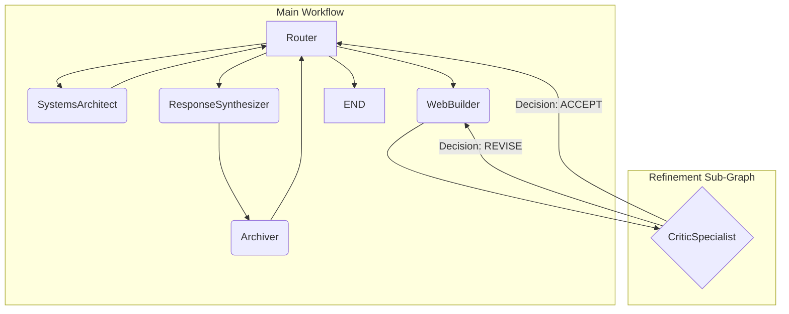

### **Specialist-Driven Conditional Routing**

* **Status:** Proposed  
* **Date:** 2025-09-18  
* **Author:** Senior Systems Architect

### 1. Context

The current workflow for artifact refinement (e.g., `SystemsArchitect` -> `WebBuilder` -> `CriticSpecialist`) is defined implicitly by the `RouterSpecialist`'s LLM-based reasoning. This creates a rigid, pre-ordained loop. The system lacks a mechanism for a specialist to act as an autonomous "gatekeeper," making a firm decision that directly alters the graph's path. This places an excessive inferential burden on the `Router` and prevents the creation of more dynamic, state-driven workflows where an artifact's quality can determine the next step (e.g., "Is this good enough to show the user, or does it need more work?").

To mature the architecture, we need a pattern that allows for conditional branching based on the explicit, structured output of a specialist, with the branching logic itself being defined declaratively in the system's configuration.

### 2. Decision

We will introduce the **Specialist-Driven Conditional Routing** pattern. This pattern elevates a specialist from a simple data processor to a decision-making node within the graph. The `CriticSpecialist` will be the first to implement this pattern.

The implementation consists of three coordinated parts:

1. **Specialist as Decider:** The `CriticSpecialist` will be enhanced to produce a structured, machine-readable `decision` (`ACCEPT` or `REVISE`) as part of its output, which it will write to the `scratchpad`.  
2. **Orchestrator as Wire-Puller:** The `GraphBuilder` will be taught to read a new `conditional_routing` flag from `config.yaml`. If this flag is present for a specialist, it will wire a conditional edge in the graph instead of the default edge back to the router.  
3. **Configuration as Blueprint:** The `config.yaml` file will be used to declaratively enable this behavior and define the target for the "revision" branch, making the workflow's structure explicit and easily modifiable.

### 3. Implementation Details

#### 3.1. Schema Enhancement (`_orchestration.py`)

The `Critique` schema, which serves as the data contract for the `CriticSpecialist`, must be updated to include the new decision field. This is the correct location as it pertains to orchestration-level feedback.

```python
# app/src/specialists/schemas/_orchestration.py

from pydantic import BaseModel, Field

from typing import List, Literal

class TriageRecommendations(BaseModel):

    """A model for the Triage specialist's recommendations."""

    recommended_specialists: List[str] = Field(

        ...,

        description="A list of specialist names that are best suited to handle the user's request. The names MUST be chosen from the list of AVAILABLE SPECIALISTS provided in the prompt."

    )

class SystemPlan(BaseModel):

    """A model for the Systems Architect's technical plan."""

    plan_summary: str = Field(..., description="A concise, one-sentence summary of the plan.")

    required_components: List[str] = Field(..., description="A list of technologies, libraries, or assets needed.")

    execution_steps: List[str] = Field(..., description="A list of detailed, sequential steps to implement the plan.")

    refinement_cycles: int = Field(default=1, description="The number of refinement cycles (e.g., with a critic) to perform.")

class Critique(BaseModel):

    """A structured critique of a generated artifact, used by the CriticSpecialist."""

    overall_assessment: str = Field(..., description="A brief, one-paragraph summary of the critique, assessing how well the artifact meets the requirements.")

    points_for_improvement: List[str] = Field(..., description="A list of specific, actionable points of feedback for what to change or add in the next iteration.")

    positive_feedback: List[str] = Field(..., description="Specific aspects of the artifact that were well-executed and should be kept or built upon.")

    # MODIFICATION: Add a machine-readable decision field to enable conditional routing.

    decision: Literal["ACCEPT", "REVISE"] = Field(..., description="The final verdict. 'REVISE' if significant changes are needed, otherwise 'ACCEPT'.")
```

#### 3.2. Specialist Logic (`critic_specialist.py`)

The specialist's logic is updated to use the new schema, leverage the `create_llm_message` helper, and write its decision to the `scratchpad`. The responsibility of recommending the next specialist is removed, as this is now handled by the graph's structure.

```python
# app/src/specialists/critic_specialist.py

import logging

from typing import Dict, Any, List

import jmespath

from .base import BaseSpecialist

from .helpers import create_llm_message, create_missing_artifact_response

from ..enums import CoreSpecialist

from ..llm.adapter import StandardizedLLMRequest

from .schemas import Critique

from langchain_core.messages import AIMessage, BaseMessage, HumanMessage

logger = logging.getLogger(__name__)

class CriticSpecialist(BaseSpecialist):

    """

    A specialist that analyzes an HTML artifact, provides a critique for

    improvement, and makes a decision to either accept or revise the artifact.

    """

    def __init__(self, specialist_name: str, specialist_config: Dict[str, Any]):

        super().__init__(specialist_name, specialist_config)

        logger.info("---INITIALIZED CriticSpecialist---")

    def _execute_logic(self, state: dict) -> Dict[str, Any]:

        logger.info("Executing CriticSpecialist logic.")

        html_artifact = state.get("artifacts", {}).get("html_document.html")

        if not html_artifact:

            # This is a critical failure. The critic cannot operate without the HTML.

            return create_missing_artifact_response(

                specialist_name=self.specialist_name,

                missing_artifacts=["html_document.html"],

                recommended_specialists=[CoreSpecialist.WEB_BUILDER.value]

            )

        contextual_messages: List[BaseMessage] = state["messages"][:]

        contextual_messages.append(HumanMessage(

            content=f"Here is the HTML document to critique:*\n*\n\`\`\`html*\n{html_artifact}*\n\`\`\`"

        ))

        request = StandardizedLLMRequest(

            messages=contextual_messages,

            output_model_class=Critique

        )

        response_data = self.llm_adapter.invoke(request)

        json_response = response_data.get("json_response")

        if not json_response:

            raise ValueError("CriticSpecialist failed to get a valid structured response from the LLM.")

        try:

            critique = Critique(**json_response)

        except Exception as e:

            logger.error(f"Pydantic validation failed for critic: {e}", exc_info=True)

            raise e

        critique_text_parts = [f"**Overall Assessment:***\n{critique.overall_assessment}*\n"]

        if critique.points_for_improvement:

            improvement_points = "*\n".join([f"- {point}" for point in critique.points_for_improvement])

            critique_text_parts.append(f"**Points for Improvement:***\n{improvement_points}*\n")

        if critique.positive_feedback:

            positive_points = "*\n".join([f"- {point}" for point in critique.positive_feedback])

            critique_text_parts.append(f"**What Went Well:***\n{positive_points}")

        critique_text = "*\n".join(critique_text_parts)

        ai_message = create_llm_message(

            specialist_name=self.specialist_name,

            llm_adapter=self.llm_adapter,

            content=f"Critique complete. My decision is to **{critique.decision}** the artifact.",

        )

        # The specialist's output is now a decision placed in the scratchpad.

        # The graph's structure, not this specialist, will determine the next step.

        return {

            "messages": [ai_message],

            "artifacts": {"critique.md": critique_text},

            "scratchpad": {"critique_decision": critique.decision}

        }
```

#### 3.3. Orchestration Logic (`graph_builder.py` and `graph_orchestrator.py`)

The `GraphBuilder` and `GraphOrchestrator` are enhanced to read the new configuration and wire the graph accordingly.

# Note: The logic previously in ChiefOfStaff is now split between
# app/src/workflow/graph_builder.py (for build-time logic) and
# app/src/workflow/graph_orchestrator.py (for run-time logic).

#### 3.4. Declarative Configuration (`config.yaml`)

The workflow is now defined declaratively. The `revision_target` can be changed to point to `systems_architect` to trigger a full re-planning, or to `web_builder` for a simple rebuild, all without code changes.

```python
# in config.yaml

specialists:

  # ... other specialists

  critic_specialist:

    type: "llm"

    prompt_file: "critic_prompt.md"

    description: "Analyzes an artifact, provides a critique, and decides if revision is needed."

    requires_artifacts: ["html_document.html"]

    artifact_providers:

      html_document.html: "web_builder"

    

    # --- NEW CONFIGURATION FOR CONDITIONAL ROUTING ---

    # This flag tells the GraphBuilder to wire this specialist as a conditional node.

    conditional_routing: true

    # This key defines the destination for the 'REVISE' branch.

    # To re-run the builder: "web_builder"

    # To re-run the entire plan: "systems_architect"

    revision_target: "web_builder"
```

### 4. Consequences

**4.1. Positive**

* **Declarative Workflows:** The core logic of the refinement loop is now controlled via configuration, making the system more flexible and easier to modify without code deployments.  
* **Increased Agent Autonomy:** The `CriticSpecialist` is now a more intelligent agent that makes a meaningful decision, reducing the inferential burden on the central `Router`.  
* **Enhanced Flexibility:** The rigid, mandatory loop is broken. Workflows that do not require a critique can now bypass it entirely, allowing the `Router` to send a completed artifact directly to the `ResponseSynthesizer`.  
* **Extensible Pattern:** This `conditional_routing` pattern can be extended to other specialists (e.g., a `code_tester_specialist`) to create more complex, state-driven workflows.

**4.2. Negative & Risks**

* **Increased Orchestration Complexity:** The logic within `GraphBuilder` and `GraphOrchestrator` is now more complex, as it must handle both default and conditional edges. This complexity must be managed carefully as more conditional nodes are added.  
* **Implicit Contracts:** The pattern relies on an implicit contract between the specialist (which writes to `scratchpad['critique_decision']`) and the orchestrator (which reads from it). This contract should be formally documented.

### 5. Workflow Diagram

The new, dynamic workflow can be visualized as follows:

