# LAS Flows

Concrete prompt → specialist flows demonstrating system behavior.

Each flow shows: **Prompt** → **Specialists Called** → **Expected Output**

---

## Flow Categories

| Category | Entry Pattern | Key Specialists |
|----------|---------------|-----------------|
| [Chat](#1-chat) | Conversational query | Triage → SA → Facilitator → Router → Alpha∥Bravo → Synthesizer |
| [File](#2-file-operations) | "read/write/list file" | Triage → SA → Facilitator → Router → PD |
| [Browser](#3-browser) | "go to / click / fill" | Triage → SA → Facilitator → Router → NavigatorBrowser |
| [Research](#4-research) | "research / investigate" | Triage → SA → Facilitator → Router → ProjectDirector |
| [Generation](#5-generation) | "create / build / generate" | Triage → SA → Facilitator → Router → Builder → Exit Interview |
| [Analysis](#6-analysis) | "analyze / extract / summarize" | Triage → SA → Facilitator → Router → Analyst |

> **Entry pipeline (#199, #217):** Every flow passes through Triage (ACCEPT/REJECT gate) → SA (task_plan) → Facilitator (gathered_context) → Router. SA failure routes to END instead of Facilitator (#217: fail-fast via `check_sa_outcome()`). Diagrams below abbreviate this as "Entry Pipeline" where the pre-Router steps are not the focus.

---

## 1. Chat

### 1.1 Simple Question
```
PROMPT: "What is the capital of France?"

FLOW:
  TriageArchitect     → PASS (no actions)
  SystemsArchitect    → task_plan: "Answer factual question about France's capital"
  Facilitator         → Context assembly (no triage actions to execute)
  Router              → Routes to tiered_chat_entrypoint
  ProgenitorAlpha     → "Paris is the capital..."
  ProgenitorBravo     → "The capital of France is Paris..."
  TieredSynthesizer   → Combines: "Paris is the capital of France."
  EndSpecialist       → Archives, returns response

OUTPUT: "Paris is the capital of France."
```

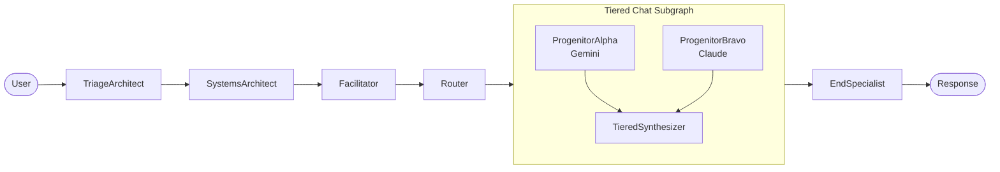

### 1.2 Comparative Question
```
PROMPT: "Compare Python and JavaScript for web development"

FLOW:
  TriageArchitect     → PASS (no context needed)
  SystemsArchitect    → task_plan: "Compare Python and JavaScript for web development"
  Facilitator         → Context assembly (minimal)
  Router              → Routes to tiered_chat_entrypoint
  ProgenitorAlpha     → Technical comparison (Gemini perspective)
  ProgenitorBravo     → Practical comparison (Claude perspective)
  TieredSynthesizer   → Merges perspectives with attribution
  EndSpecialist       → Archives

OUTPUT: Multi-perspective comparison with "Alpha notes..." / "Bravo adds..."
```

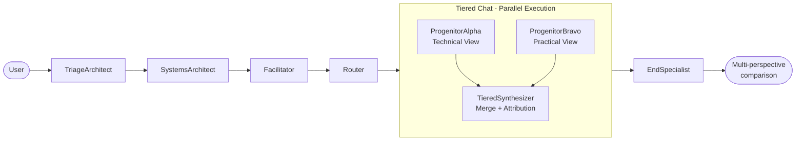

### 1.3 Greeting (Fast Path)
```
PROMPT: "Hello"

FLOW:
  TriageArchitect     → PASS (simple greeting, no actions)
  SystemsArchitect    → task_plan: "Respond to user greeting"
  Facilitator         → Context assembly (minimal)
  Router              → Routes to default_responder
  DefaultResponder    → "Hello! How can I help you today?"
  EndSpecialist       → Archives

OUTPUT: Greeting response (no progenitors needed)
```

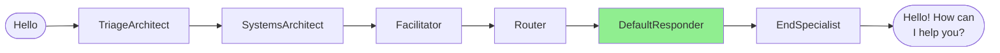

---

## 2. File Operations

### 2.1 Read File
```
PROMPT: "Read the contents of README.md"

FLOW:
  TriageArchitect     → PASS — detects file read, creates ContextPlan
                        actions: [READ_FILE("README.md")]
  SystemsArchitect    → task_plan: "Read and display README.md contents"
  Facilitator         → MCP: filesystem.read_file("README.md")
                        gathered_context includes file contents
  Router              → Context available, routes to chat
  ChatSpecialist      → Presents file content
  EndSpecialist       → Archives

OUTPUT: File contents displayed to user
```

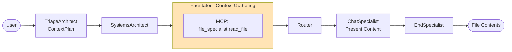

### 2.2 Write File
```
PROMPT: "Create a file called notes.txt with 'Hello World'"

FLOW:
  TriageArchitect     → Detects file write intent
  SystemsArchitect    → task_plan: "Create notes.txt with Hello World content"
  Facilitator         → Context assembly
  Router              → Routes to project_director
  ProjectDirector     → ReAct loop via react_step MCP:
                        Tool: filesystem.write_file("notes.txt", "Hello World")
                        Action: DONE
  ExitInterview       → Verifies file creation
  EndSpecialist       → Archives

OUTPUT: "Created notes.txt successfully"
```

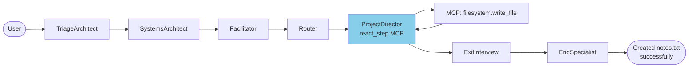

### 2.3 List Directory
```
PROMPT: "What files are in the workspace?"

FLOW:
  TriageArchitect     → Detects directory listing
                        actions: [LIST_DIRECTORY("/workspace")]
  Facilitator         → MCP: file_specialist.list_dir("/workspace")
  Router              → Routes to chat with listing
  ChatSpecialist      → Formats and presents listing
  EndSpecialist       → Archives

OUTPUT: Formatted directory listing
```


---

## 3. Browser

### 3.1 Navigate to URL
```
PROMPT: "Go to github.com"

FLOW:
  TriageArchitect     → Detects web navigation
  Router              → Routes to navigator_browser_specialist
  NavigatorBrowser    → Creates session
                        MCP: navigator.goto("https://github.com")
                        MCP: navigator.screenshot()
  EndSpecialist       → Archives with screenshot artifact

OUTPUT: Screenshot of github.com, session preserved
```

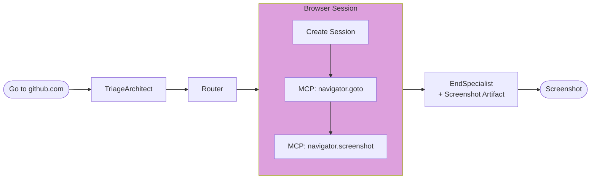

### 3.2 Click Element
```
PROMPT: "Click the Sign In button"
CONTEXT: Active browser session from previous turn

FLOW:
  TriageArchitect     → Detects click intent, has session
  Router              → Routes to navigator_browser_specialist
  NavigatorBrowser    → Retrieves session from artifacts
                        MCP: navigator.click("Sign In button")
                        → Fara visual grounding finds element
                        MCP: navigator.screenshot()
  EndSpecialist       → Archives with updated screenshot

OUTPUT: Screenshot showing sign-in page
```


### 3.3 Fill Form
```
PROMPT: "Type 'hello@example.com' in the email field"

FLOW:
  TriageArchitect     → Detects form fill intent
  Router              → Routes to navigator_browser_specialist
  NavigatorBrowser    → MCP: navigator.type("email field", "hello@example.com")
                        → Fara locates "email field"
                        MCP: navigator.screenshot()
  EndSpecialist       → Archives

OUTPUT: Screenshot showing filled form
```


---

## 4. Research

### 4.1 Simple Research
```
PROMPT: "What are the latest developments in quantum computing?"

FLOW:
  TriageArchitect     → Detects research intent
  SystemsArchitect    → task_plan: "Research quantum computing developments"
  Facilitator         → Context assembly
  Router              → Routes to project_director
  ProjectDirector     → ReAct loop via react_step MCP:
    Iteration 1: search("quantum computing 2026 developments")
    Iteration 2: browse(url1), browse(url2)
    Iteration 3: DONE — synthesize findings into final_response
  ExitInterview       → Verifies research completeness
  EndSpecialist       → Archives with report artifact

OUTPUT: Comprehensive research report with citations
```

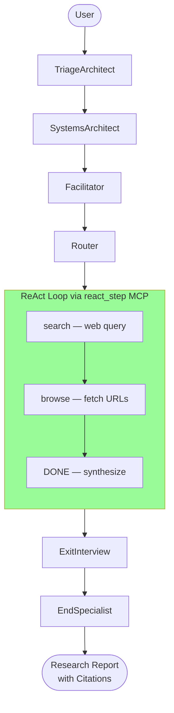

### 4.2 Comparative Research
```
PROMPT: "Compare React vs Vue for a new project"

FLOW:
  TriageArchitect     → Complex research, multiple angles
  SystemsArchitect    → task_plan: "Compare React and Vue frameworks"
  Facilitator         → Context assembly
  Router              → Routes to project_director
  ProjectDirector     → ReAct loop (4-6 iterations):
    - search("React vs Vue 2026")
    - search("React performance benchmarks")
    - search("Vue developer experience")
    - browse(key articles)
    - DONE — synthesize comparison
  ExitInterview       → Verifies completeness
  EndSpecialist       → Archives

OUTPUT: Comparative analysis with pros/cons/recommendations
```

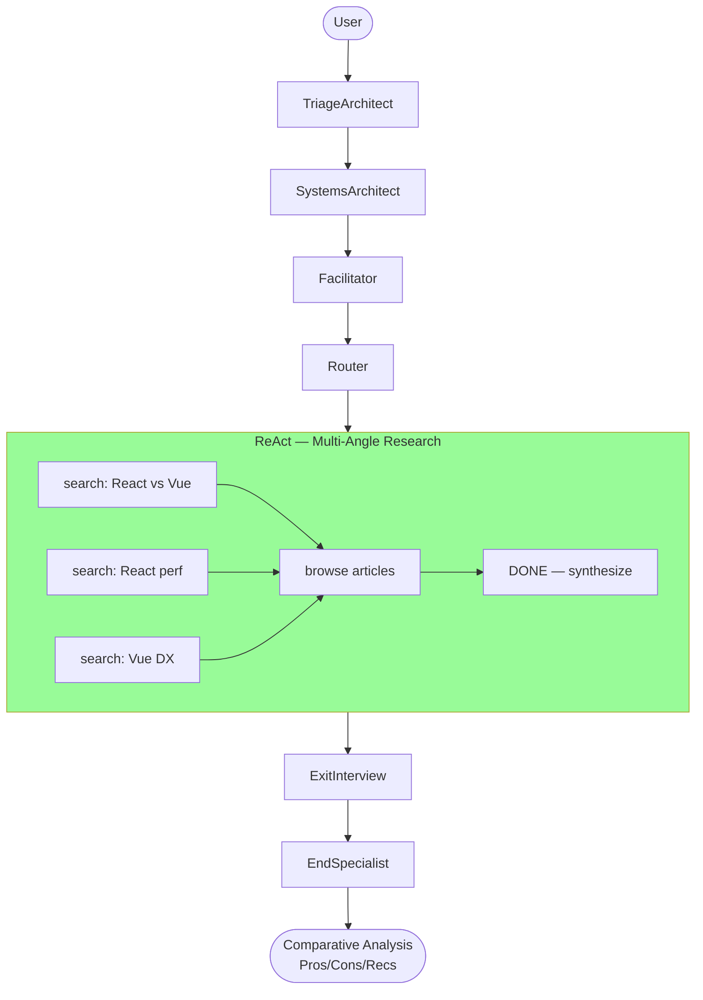

---

## 5. Generation

### 5.1 HTML Generation
```
PROMPT: "Create a landing page for a coffee shop"

FLOW:
  TriageArchitect     → Detects generation intent
  Router              → Routes to web_builder
  WebBuilder          → Generates HTML artifact
                        artifacts: {html_document: "<!DOCTYPE..."}
  ExitInterview       → Evaluates completion
  [If incomplete]     → Router re-routes for refinement
  [If complete]       → EndSpecialist archives

OUTPUT: HTML file in artifacts, viewable in browser
```


### 5.2 Technical Plan
```
PROMPT: "Design an authentication system for my app"

FLOW:
  TriageArchitect     → PASS (architecture/planning intent)
  SystemsArchitect    → task_plan: detailed authentication design
                        (SA captures full intent as task_plan — planning IS its pipeline role)
  Facilitator         → Context assembly
  Router              → Routes to tiered_chat_entrypoint (for elaboration)
  ProgenitorAlpha/Bravo → Expand on plan details
  TieredSynthesizer   → Combines perspectives
  EndSpecialist       → Archives plan

OUTPUT: Structured technical plan document

NOTE: SA is CORE_INFRASTRUCTURE (#171), not routable by Router.
The task_plan itself contains the architectural design. For elaboration,
Router selects a chat or analysis specialist.
```

---

## 6. Analysis

### 6.1 Text Summary
```
PROMPT: "Summarize this article: [long text]"

FLOW:
  TriageArchitect     → Text analysis with content provided
  Router              → Routes to summarizer_specialist
  SummarizerSpecialist → MCP-based condensation
  EndSpecialist       → Archives

OUTPUT: Condensed summary
```

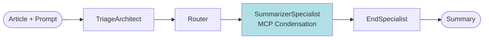

### 6.2 Sentiment Analysis
```
PROMPT: "What's the sentiment of these reviews?"

FLOW:
  TriageArchitect     → Sentiment analysis intent
  Router              → Routes to sentiment_classifier
  SentimentClassifier → Analyzes text sentiment
  EndSpecialist       → Archives

OUTPUT: Sentiment classification with confidence scores
```

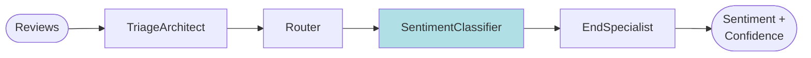

### 6.3 Data Extraction
```
PROMPT: "Extract all email addresses from this document"

FLOW:
  TriageArchitect     → Data extraction intent
  SystemsArchitect    → task_plan: "Extract email addresses from document"
  Facilitator         → Context assembly (document content)
  Router              → Routes to text_analysis_specialist
  TextAnalysis        → Single-pass analysis: extracts emails via structured output
  EndSpecialist       → Archives

OUTPUT: Structured list of extracted emails
```

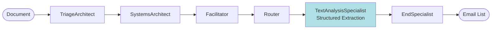

---

## System Overview

For the hub-and-spoke architecture diagram and routing concepts, see [ARCHITECTURE.md § 3.1](ARCHITECTURE.md#31-hub-and-spoke).

**Key points:**
- All flows enter via TriageArchitect → SystemsArchitect → Facilitator → Router (#199, #217: SA failure short-circuits to END)
- Router is the central hub — specialists return to router after execution
- All flows exit via EndSpecialist → ArchiverSpecialist

---

## Flow Invariants

Every flow satisfies:

1. **Entry:** Always starts at TriageArchitect → SystemsArchitect → Facilitator → Router (#199, #217: SA failure → END)
2. **Exit:** Always ends at EndSpecialist (archives result)
3. **Safety:** All specialist execution wrapped by NodeExecutor
4. **State:** Specialists return dicts, never mutate GraphState directly
5. **Failover:** Errors route to error handling, not silent failure
6. **Gate before investment:** Triage rejects underspecified prompts (ask_user only → END) before SA invests an LLM call


---

## Testing Flows

Every flow has a corresponding **zero-mock integration test** that runs real prompts through the streaming API.

**Test file:** [app/tests/integration/test_flows.py](../app/tests/integration/test_flows.py)

**API used:** [POST /v1/graph/stream](API_REFERENCE.md#post-v1graphstream)

```python
@pytest.mark.integration
def test_flow_1_1_simple_question(api_client):
    """Flow 1.1: Simple Question (Tiered Chat)"""
    result = invoke_flow(api_client, "What is the capital of France?")

    # Verify specialists called (from SSE events)
    assert_specialists_called(
        result,
        ["triage_architect", "router_specialist"],
        "Flow 1.1: Missing core specialists"
    )

    # Verify no errors
    assert not result['errors']
```

**Run flow tests:**
```bash
# Inside Docker container
pytest app/tests/integration/test_flows.py -v

# Run specific flow category
pytest app/tests/integration/test_flows.py::TestChatFlows -v

# Skip slow research tests
pytest app/tests/integration/test_flows.py -v -m "not slow"
```

---

## Adding New Flows

When adding a new capability:

1. Write the expected flow (prompt → specialists → output)
2. Add to this document with Mermaid diagram
3. Add corresponding test to [test_flows.py](../app/tests/integration/test_flows.py)
4. Implement specialists as needed
5. Run tests to verify flow matches documentation
