# LAS Flows

Concrete prompt → specialist flows demonstrating system behavior.

Each flow shows: **Prompt** → **Specialists Called** → **Expected Output**

---

## Flow Categories

| Category | Entry Pattern | Key Specialists |
|----------|---------------|-----------------|
| [Chat](#1-chat) | Conversational query | Triage → Router → Alpha∥Bravo → Synthesizer |
| [File](#2-file-operations) | "read/write/list file" | Triage → Facilitate → Router → Response |
| [Browser](#3-browser) | "go to / click / fill" | Triage → Router → NavigatorBrowser |
| [Research](#4-research) | "research / investigate" | Triage → Router → ResearchOrchestrator |
| [Generation](#5-generation) | "create / build / generate" | Triage → Router → Builder → Exit Interview |
| [Analysis](#6-analysis) | "analyze / extract / summarize" | Triage → Router → Analyst |

---

## 1. Chat

### 1.1 Simple Question
```
PROMPT: "What is the capital of France?"

FLOW:
  TriageArchitect     → No context needed, ready to route
  Router              → Routes to tiered_chat_entrypoint
  ProgenitorAlpha     → "Paris is the capital..."
  ProgenitorBravo     → "The capital of France is Paris..."
  TieredSynthesizer   → Combines: "Paris is the capital of France."
  EndSpecialist       → Archives, returns response

OUTPUT: "Paris is the capital of France."
```

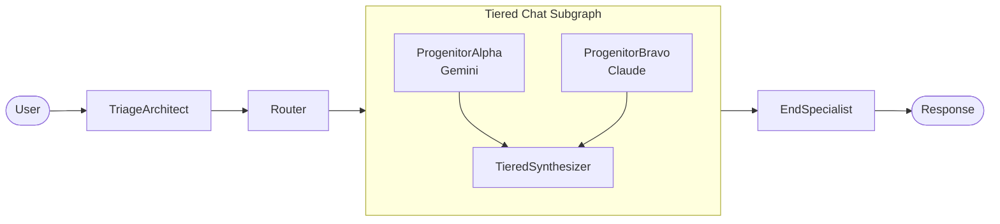

### 1.2 Comparative Question
```
PROMPT: "Compare Python and JavaScript for web development"

FLOW:
  TriageArchitect     → No context needed
  Router              → Routes to tiered_chat_entrypoint
  ProgenitorAlpha     → Technical comparison (Gemini perspective)
  ProgenitorBravo     → Practical comparison (Claude perspective)
  TieredSynthesizer   → Merges perspectives with attribution
  EndSpecialist       → Archives

OUTPUT: Multi-perspective comparison with "Alpha notes..." / "Bravo adds..."
```

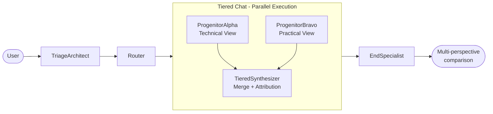

### 1.3 Greeting (Fast Path)
```
PROMPT: "Hello"

FLOW:
  TriageArchitect     → Simple greeting detected
  Router              → Routes to default_responder
  DefaultResponder    → "Hello! How can I help you today?"
  EndSpecialist       → Archives

OUTPUT: Greeting response (no progenitors needed)
```

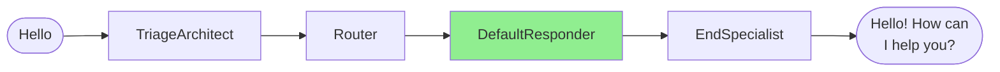

---

## 2. File Operations

### 2.1 Read File
```
PROMPT: "Read the contents of README.md"

FLOW:
  TriageArchitect     → Detects file read, creates ContextPlan
                        actions: [READ_FILE("README.md")]
  Facilitator         → MCP: file_specialist.read_file("README.md")
                        gathered_context: {README.md: "...content..."}
  Router              → Context available, routes to chat
  ChatSpecialist      → Presents file content
  EndSpecialist       → Archives

OUTPUT: File contents displayed to user
```

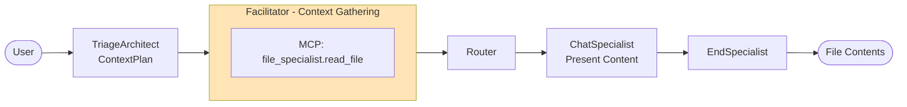

### 2.2 Write File
```
PROMPT: "Create a file called notes.txt with 'Hello World'"

FLOW:
  TriageArchitect     → Detects file write intent
  Router              → Routes to file_operations_specialist
  FileOperationsSpec  → LLM parses intent, calls MCP
                        MCP: file_specialist.write_file("notes.txt", "Hello World")
  EndSpecialist       → Archives

OUTPUT: "Created notes.txt successfully"
```

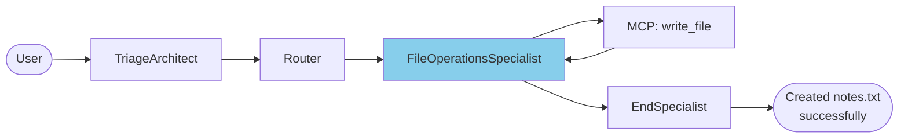

### 2.3 List Directory
```
PROMPT: "What files are in the workspace?"

FLOW:
  TriageArchitect     → Detects directory listing
                        actions: [LIST_DIRECTORY("/workspace")]
  Facilitator         → MCP: file_specialist.list_dir("/workspace")
  Router              → Routes to chat with listing
  ChatSpecialist      → Formats and presents listing
  EndSpecialist       → Archives

OUTPUT: Formatted directory listing
```

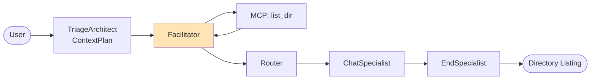

---

## 3. Browser

### 3.1 Navigate to URL
```
PROMPT: "Go to github.com"

FLOW:
  TriageArchitect     → Detects web navigation
  Router              → Routes to navigator_browser_specialist
  NavigatorBrowser    → Creates session
                        MCP: navigator.goto("https://github.com")
                        MCP: navigator.screenshot()
  EndSpecialist       → Archives with screenshot artifact

OUTPUT: Screenshot of github.com, session preserved
```


### 3.2 Click Element
```
PROMPT: "Click the Sign In button"
CONTEXT: Active browser session from previous turn

FLOW:
  TriageArchitect     → Detects click intent, has session
  Router              → Routes to navigator_browser_specialist
  NavigatorBrowser    → Retrieves session from artifacts
                        MCP: navigator.click("Sign In button")
                        → Fara visual grounding finds element
                        MCP: navigator.screenshot()
  EndSpecialist       → Archives with updated screenshot

OUTPUT: Screenshot showing sign-in page
```

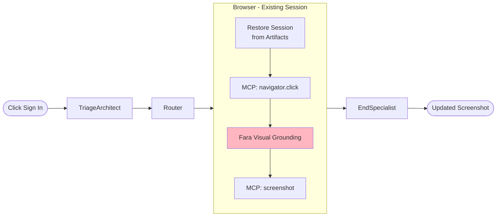

### 3.3 Fill Form
```
PROMPT: "Type 'hello@example.com' in the email field"

FLOW:
  TriageArchitect     → Detects form fill intent
  Router              → Routes to navigator_browser_specialist
  NavigatorBrowser    → MCP: navigator.type("email field", "hello@example.com")
                        → Fara locates "email field"
                        MCP: navigator.screenshot()
  EndSpecialist       → Archives

OUTPUT: Screenshot showing filled form
```

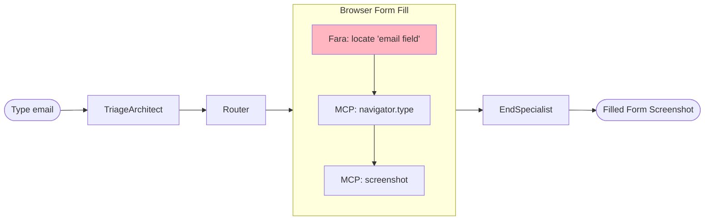

---

## 4. Research

### 4.1 Simple Research
```
PROMPT: "What are the latest developments in quantum computing?"

FLOW:
  TriageArchitect     → Detects research intent
  Router              → Routes to research_orchestrator
  ResearchOrchestrator → ReAct loop:
    Iteration 1:
      DECIDE: Search for "quantum computing 2025 developments"
      EXECUTE: MCP: web_specialist.search(...)
      OBSERVE: 10 results returned
      UPDATE: Add to knowledge base
    Iteration 2:
      DECIDE: Browse top 3 results
      EXECUTE: MCP: browse_specialist.fetch(url1, url2, url3)
      OBSERVE: Content retrieved
      UPDATE: Extract key findings
    Iteration 3:
      DECIDE: Sufficient information, synthesize
      COMPLETE: Pass to synthesizer
  SynthesizerSpecialist → Compiles research report
  EndSpecialist       → Archives with report artifact

OUTPUT: Comprehensive research report with citations
```

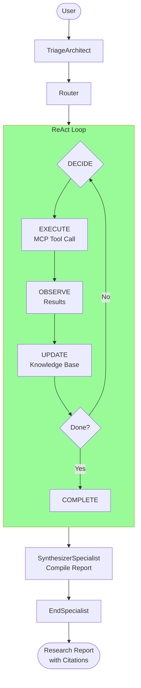

### 4.2 Comparative Research
```
PROMPT: "Compare React vs Vue for a new project"

FLOW:
  TriageArchitect     → Complex research, multiple angles
  Router              → Routes to research_orchestrator
  ResearchOrchestrator → ReAct loop (4-6 iterations):
    - Search "React vs Vue 2025"
    - Search "React performance benchmarks"
    - Search "Vue developer experience"
    - Browse key articles
    - Judge relevance (MCP: inference_service)
    - Synthesize comparison
  SynthesizerSpecialist → Structured comparison
  EndSpecialist       → Archives

OUTPUT: Comparative analysis with pros/cons/recommendations
```

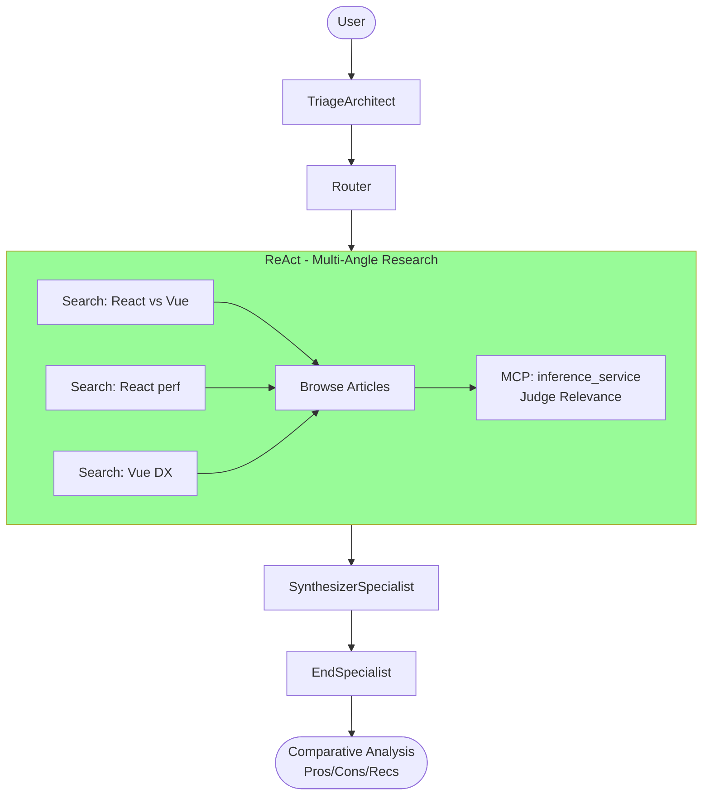

---

## 5. Generation

### 5.1 HTML Generation
```
PROMPT: "Create a landing page for a coffee shop"

FLOW:
  TriageArchitect     → Detects generation intent
  Router              → Routes to web_builder
  WebBuilder          → Generates HTML artifact
                        artifacts: {html_document: "<!DOCTYPE..."}
  ExitInterview       → Evaluates completion
  [If incomplete]     → Router re-routes for refinement
  [If complete]       → EndSpecialist archives

OUTPUT: HTML file in artifacts, viewable in browser
```

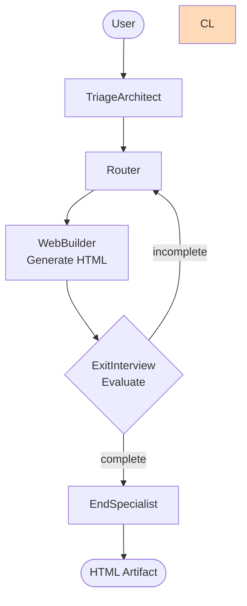

### 5.2 Technical Plan
```
PROMPT: "Design an authentication system for my app"

FLOW:
  TriageArchitect     → Detects architecture/planning intent
  Router              → Routes to systems_architect
  SystemsArchitect    → Generates technical plan
                        - Requirements analysis
                        - Component design
                        - Implementation steps
  EndSpecialist       → Archives plan

OUTPUT: Structured technical plan document
```

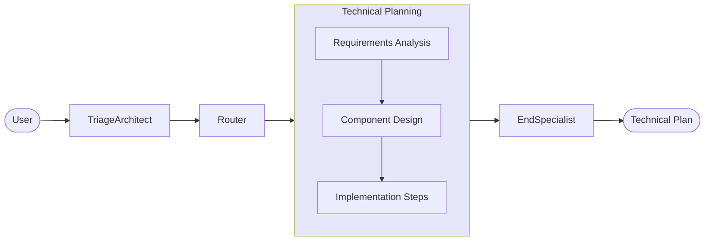

---

## 6. Analysis

### 6.1 Text Summary
```
PROMPT: "Summarize this article: [long text]"

FLOW:
  TriageArchitect     → Text analysis with content provided
  Router              → Routes to summarizer_specialist
  SummarizerSpecialist → MCP-based condensation
  EndSpecialist       → Archives

OUTPUT: Condensed summary
```


### 6.2 Sentiment Analysis
```
PROMPT: "What's the sentiment of these reviews?"

FLOW:
  TriageArchitect     → Sentiment analysis intent
  Router              → Routes to sentiment_classifier
  SentimentClassifier → Analyzes text sentiment
  EndSpecialist       → Archives

OUTPUT: Sentiment classification with confidence scores
```

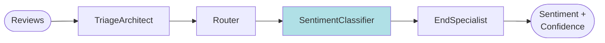

### 6.3 Data Extraction
```
PROMPT: "Extract all email addresses from this document"

FLOW:
  TriageArchitect     → Data extraction intent
  Router              → Routes to data_extractor
  DataExtractor       → Pattern-based extraction
  EndSpecialist       → Archives

OUTPUT: Structured list of extracted emails
```

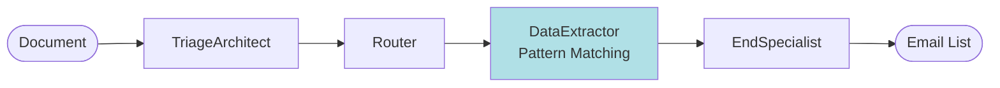

---

## System Overview

For the hub-and-spoke architecture diagram and routing concepts, see [ARCHITECTURE.md § 3.1](ARCHITECTURE.md#31-hub-and-spoke).

**Key points:**
- All flows enter via TriageArchitect
- Router is the central hub - specialists return to router after execution
- All flows exit via EndSpecialist → ArchiverSpecialist

---

## Flow Invariants

Every flow satisfies:

1. **Entry:** Always starts at TriageArchitect
2. **Exit:** Always ends at EndSpecialist (archives result)
3. **Safety:** All specialist execution wrapped by NodeExecutor
4. **State:** Specialists return dicts, never mutate GraphState directly
5. **Failover:** Errors route to error handling, not silent failure

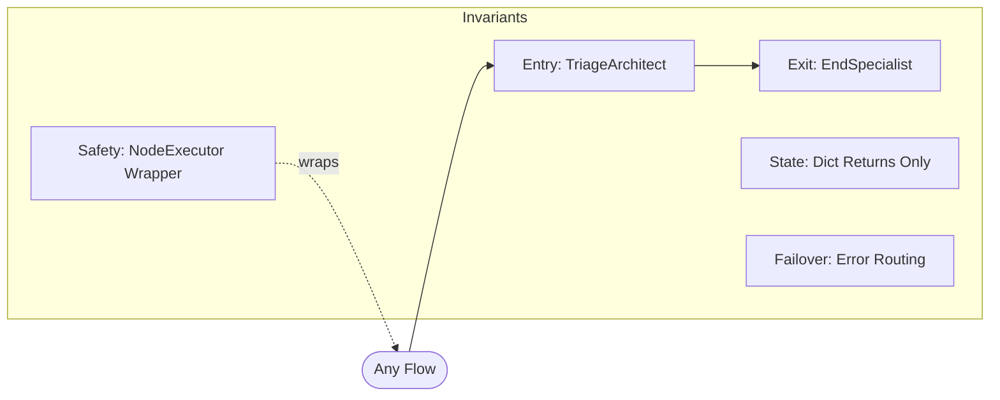

---

## Testing Flows

Every flow has a corresponding **zero-mock integration test** that runs real prompts through the streaming API.

**Test file:** [app/tests/integration/test_flows.py](../app/tests/integration/test_flows.py)

**API used:** [POST /v1/graph/stream](API_REFERENCE.md#post-v1graphstream)

```python
@pytest.mark.integration
def test_flow_1_1_simple_question(api_client):
    """Flow 1.1: Simple Question (Tiered Chat)"""
    result = invoke_flow(api_client, "What is the capital of France?")

    # Verify specialists called (from SSE events)
    assert_specialists_called(
        result,
        ["triage_architect", "router_specialist"],
        "Flow 1.1: Missing core specialists"
    )

    # Verify no errors
    assert not result['errors']
```

**Run flow tests:**
```bash
# Inside Docker container
pytest app/tests/integration/test_flows.py -v

# Run specific flow category
pytest app/tests/integration/test_flows.py::TestChatFlows -v

# Skip slow research tests
pytest app/tests/integration/test_flows.py -v -m "not slow"
```

---

## Adding New Flows

When adding a new capability:

1. Write the expected flow (prompt → specialists → output)
2. Add to this document with Mermaid diagram
3. Add corresponding test to [test_flows.py](../app/tests/integration/test_flows.py)
4. Implement specialists as needed
5. Run tests to verify flow matches documentation
