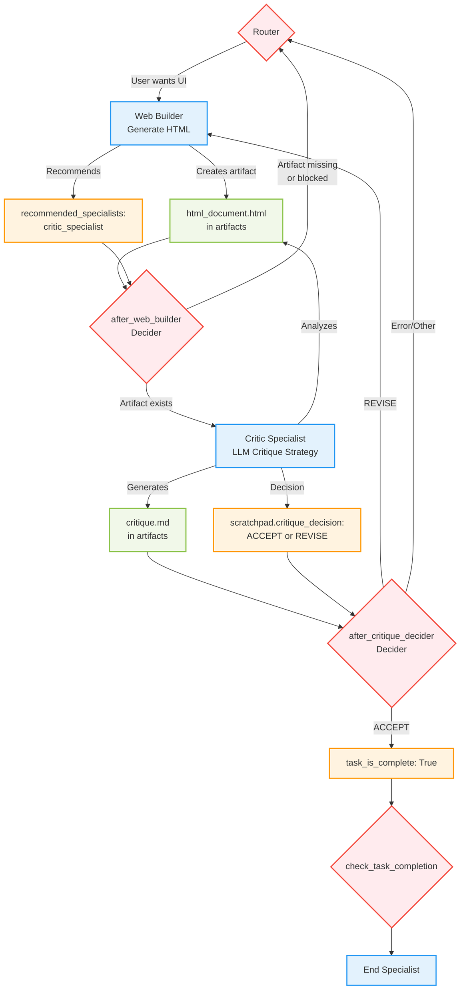
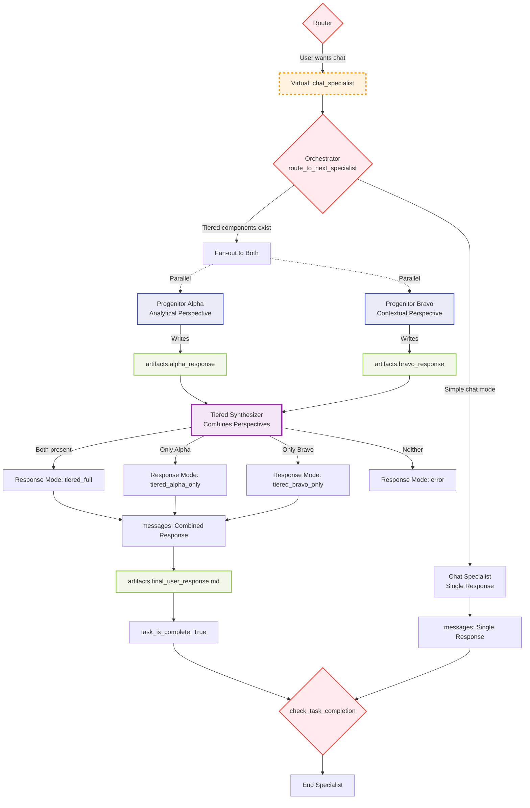
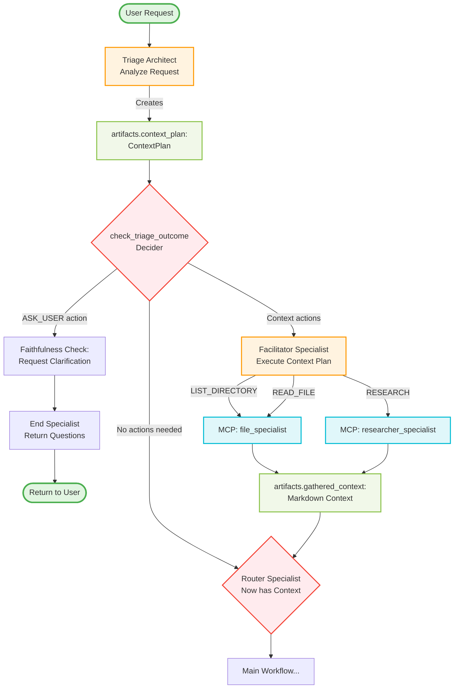
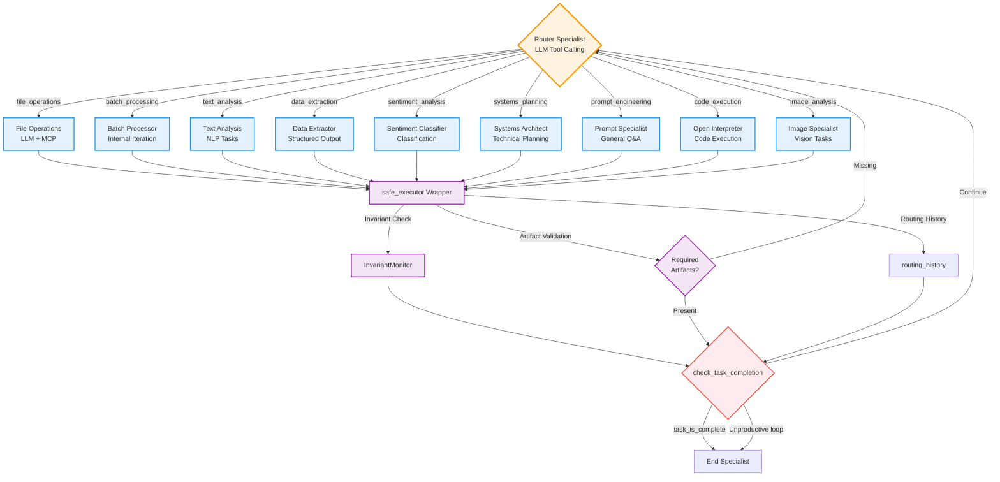
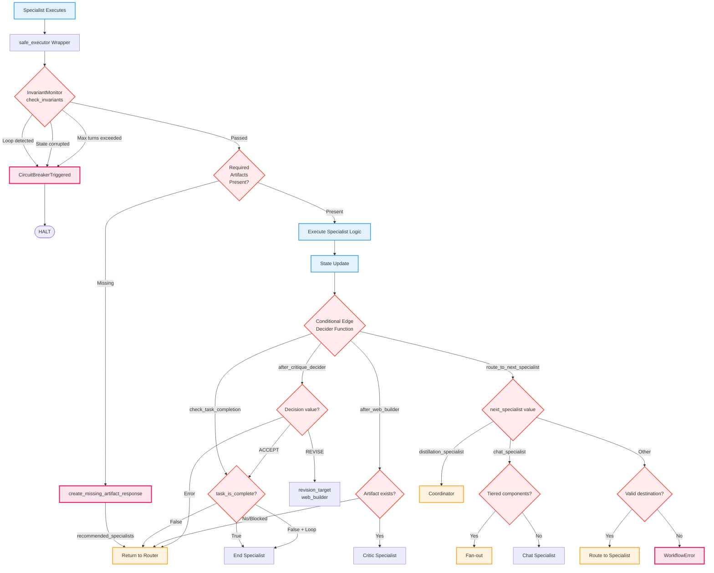
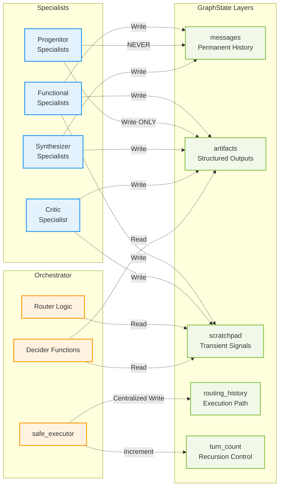

# Graph Architecture Visualizations

This document provides Mermaid diagrams visualizing the LangGraph agentic system architecture, subgraph patterns, and decision flows.

## Table of Contents
1. [Overall System Architecture](#1-overall-system-architecture)
2. [Web Builder ↔ Critic Subgraph](#2-web-builder--critic-subgraph-adr-core-012)
3. [Tiered Chat Subgraph](#3-tiered-chat-subgraph-core-chat-002)
4. [Context Engineering Flow](#4-context-engineering-flow)
5. [Hub-and-Spoke Pattern](#5-hub-and-spoke-pattern)
6. [Distillation Subgraph](#6-distillation-subgraph)
7. [Orchestrator Decision Flow](#7-orchestrator-decision-flow)
8. [State Flow](#8-state-flow-management)

---

## 1. Overall System Architecture

High-level view of all major components and how they connect.

```mermaid
graph TB
    %% Entry Point
    START([User Request])

    %% Context Engineering Subgraph
    START --> TRIAGE[Triage Architect<br/>Context Analysis]

    TRIAGE -->|ASK_USER| END_SPEC
    TRIAGE -->|Needs Context| FACILITATOR[Facilitator<br/>Gathers Context]
    TRIAGE -->|Ready| ROUTER

    FACILITATOR -->|Context Gathered| ROUTER

    %% Main Routing Hub
    ROUTER{Router Specialist<br/>Capability Selection}

    %% Hub-and-Spoke to Functional Specialists
    ROUTER -->|File Ops| FILE_OPS[File Operations]
    ROUTER -->|Analysis| ANALYSIS[Text Analysis]
    ROUTER -->|Planning| SYSTEMS_ARCH[Systems Architect]
    ROUTER -->|Data| DATA_PROC[Data Processing]
    ROUTER -->|Code Execution| OPEN_INT[Open Interpreter]

    %% Virtual Routing to Subgraphs
    ROUTER -->|Chat| CHAT_SUBGRAPH[[Tiered Chat Subgraph]]
    ROUTER -->|Web UI| WEB_SUBGRAPH[[Web Builder ↔ Critic]]
    ROUTER -->|Distillation| DIST_SUBGRAPH[[Distillation Subgraph]]

    %% Functional Specialists back to Router
    FILE_OPS -->|Task Complete?| CHECK_COMPLETE
    ANALYSIS -->|Task Complete?| CHECK_COMPLETE
    SYSTEMS_ARCH -->|Task Complete?| CHECK_COMPLETE
    DATA_PROC -->|Task Complete?| CHECK_COMPLETE
    OPEN_INT -->|Task Complete?| CHECK_COMPLETE

    %% Subgraphs to Completion Check
    CHAT_SUBGRAPH -->|Response Ready| CHECK_COMPLETE
    WEB_SUBGRAPH -->|Accepted| CHECK_COMPLETE
    DIST_SUBGRAPH -->|Dataset Complete| CHECK_COMPLETE

    %% Task Completion Decision
    CHECK_COMPLETE{Task Complete?}
    CHECK_COMPLETE -->|No| ROUTER
    CHECK_COMPLETE -->|Yes| END_SPEC[End Specialist<br/>Synthesize & Archive]

    %% Final Output
    END_SPEC --> END_NODE([END<br/>Return to User])

    %% Styling
    classDef entryExit fill:#e1f5e1,stroke:#4caf50,stroke-width:3px
    classDef routing fill:#fff3e0,stroke:#ff9800,stroke-width:2px
    classDef functional fill:#e3f2fd,stroke:#2196f3,stroke-width:2px
    classDef subgraph fill:#f3e5f5,stroke:#9c27b0,stroke-width:2px
    classDef decision fill:#ffebee,stroke:#f44336,stroke-width:2px

    class START,END_NODE entryExit
    class TRIAGE,FACILITATOR,ROUTER routing
    class FILE_OPS,ANALYSIS,SYSTEMS_ARCH,DATA_PROC,OPEN_INT,END_SPEC functional
    class CHAT_SUBGRAPH,WEB_SUBGRAPH,DIST_SUBGRAPH subgraph
    class CHECK_COMPLETE decision
```

**Key Observations:**
- **Entry Point**: Triage Architect performs pre-flight context engineering
- **Router**: Central hub for capability-based routing
- **Subgraphs**: Encapsulated multi-specialist workflows (chat, web, distillation)
- **Functional Specialists**: Single-task specialists in hub-and-spoke pattern
- **End Specialist**: Centralized termination and synthesis point

---

## 2. Web Builder ↔ Critic Subgraph (ADR-CORE-012)

Generate-critique-refine loop for UI artifact creation.



**Critical Points:**
1. **Direct Edge**: `web_builder` → `after_web_builder` → `critic_specialist` (no router hop)
2. **Revision Loop**: `critic_specialist` → `after_critique_decider` → `web_builder` (if REVISE)
3. **Configuration**: `critic_specialist.revision_target: "web_builder"` defines the loop
4. **Termination**: Only critic can set `task_is_complete` flag
5. **Exclusion**: Both specialists excluded from router's tool schema

**State Changes:**
- Web Builder writes to: `artifacts["html_document.html"]`, `scratchpad["recommended_specialists"]`
- Critic writes to: `artifacts["critique.md"]`, `scratchpad["critique_decision"]`, `task_is_complete`

---

## 3. Tiered Chat Subgraph (CORE-CHAT-002)

Parallel multi-perspective response generation with virtual coordinator pattern.



**Critical State Management Pattern:**

**❌ WRONG - Causes Message Pollution:**
```python
# ProgenitorAlpha (INCORRECT)
return {
    "messages": [AIMessage(content=alpha_response)]  # NO!
}
```

**✅ CORRECT - Artifacts for Parallel, Messages for Join:**
```python
# ProgenitorAlpha (CORRECT)
return {
    "artifacts": {"alpha_response": alpha_response}  # Write to artifacts
}

# TieredSynthesizer (CORRECT - Join Node)
return {
    "messages": [AIMessage(content=combined)],  # Write to messages
    "artifacts": {"final_user_response.md": combined},
    "task_is_complete": True
}
```

**Why This Matters:**
- **Without pattern**: 4 messages per turn (user, alpha, bravo, synthesizer) = 78% token waste
- **With pattern**: 2 messages per turn (user, synthesizer) = Clean conversation history

**Graph Wiring (Array Syntax for Join):**
```python
# CRITICAL: Array syntax tells LangGraph to wait for BOTH
workflow.add_edge(
    ["progenitor_alpha_specialist", "progenitor_bravo_specialist"],
    "tiered_synthesizer_specialist"
)
```

---

## 4. Context Engineering Flow

Pre-workflow information gathering to prevent hallucination.



**Context Actions:**
- **LIST_DIRECTORY**: Enumerate files to discover available context
- **READ_FILE**: Read specific files mentioned in prompt
- **RESEARCH**: Web search for real-time information
- **ASK_USER**: Faithfulness check - ask for clarification instead of guessing

**Faithfulness Principle:**
> "When ambiguous, ask; when certain, gather; when complete, route."

**Example Flow:**
```
User: "Fix the bug in the authentication module"

Triage: [Ambiguous - which file?]
  → Action: ASK_USER("Which file contains the authentication module?")
  → Routes to: end_specialist (returns question to user)

User: "Fix the bug in auth.py"

Triage: [File mentioned but not in context]
  → Action: READ_FILE("auth.py")
  → Routes to: facilitator_specialist

Facilitator: [Reads auth.py via MCP]
  → gathered_context: "```python\n[auth.py contents]\n```"
  → Routes to: router_specialist

Router: [Now has file context]
  → Routes to: appropriate specialist with context
```

---

## 5. Hub-and-Spoke Pattern

How the router connects to functional specialists.



**Safe Executor Responsibilities:**
1. **Pre-execution**: Invariant checking (loop detection, state integrity)
2. **Artifact validation**: Ensure required artifacts available
3. **Centralized routing history**: Track execution path
4. **Exception handling**: Convert specialist errors to structured error reports
5. **Parallel task barriers**: Coordinate fan-out/join synchronization

**Excluded from Hub-and-Spoke:**
- Subgraph components (web_builder, critic, progenitors, etc.)
- MCP-only services (researcher, summarizer)
- Context engineering (triage, facilitator)
- Orchestration (router, end, archiver)

**Router Tool Schema:**
The router sees only the functional specialists' capabilities as tools:
```json
{
  "tools": [
    {"name": "file_operations", "description": "Read, write, list files"},
    {"name": "text_analysis", "description": "Analyze text content"},
    {"name": "chat_specialist", "description": "Conversational responses"}
    // NOTE: Does NOT see web_builder, critic, progenitors
  ]
}
```

---

## 6. Distillation Subgraph

Multi-phase dataset generation with coordinator.

```mermaid
graph TB
    %% Entry - Virtual Routing
    ROUTER{Router}
    ROUTER -->|distillation_specialist| VIRTUAL[Virtual:<br/>distillation_specialist]

    VIRTUAL --> COORD_START[Distillation Coordinator<br/>Initialize State]

    COORD_START -->|Phase 1| EXPANSION_PHASE[Expansion Phase]

    %% Expansion Phase
    EXPANSION_PHASE --> EXPANDER[Prompt Expander<br/>Generate Variations]

    EXPANDER -->|Creates| EXPANDED[expanded_prompts list]
    EXPANDED --> AGGREGATOR[Prompt Aggregator<br/>Collect Expanded]

    AGGREGATOR --> CONTINUE_EXPAND{should_continue_expanding?<br/>expansion_index < seed_prompts.length}

    CONTINUE_EXPAND -->|Yes| EXPANDER
    CONTINUE_EXPAND -->|No| COORD_PHASE2[Coordinator<br/>Transition to Collection]

    %% Collection Phase
    COORD_PHASE2 -->|Phase 2| COLLECTION_PHASE[Collection Phase]

    COLLECTION_PHASE --> COLLECTOR[Response Collector<br/>Generate Responses]

    COLLECTOR -->|Creates| RESPONSES[response_dataset list]
    RESPONSES --> CONTINUE_COLLECT{should_continue_collecting?<br/>collection_index < expanded_prompts.length}

    CONTINUE_COLLECT -->|Yes| COLLECTOR
    CONTINUE_COLLECT -->|No| COORD_FINAL[Coordinator<br/>Finalize Dataset]

    COORD_FINAL --> DATASET_ART[artifacts.distillation_dataset]
    DATASET_ART --> TASK_COMPLETE[task_is_complete: True]

    TASK_COMPLETE --> CHECK{check_task_completion}
    CHECK --> END_SPEC[End Specialist]

    %% Styling
    classDef coordinator fill:#f3e5f5,stroke:#9c27b0,stroke-width:3px
    classDef phase fill:#e3f2fd,stroke:#2196f3,stroke-width:2px
    classDef decision fill:#ffebee,stroke:#f44336,stroke-width:2px
    classDef artifact fill:#f1f8e9,stroke:#8bc34a,stroke-width:2px

    class COORD_START,COORD_PHASE2,COORD_FINAL coordinator
    class EXPANDER,AGGREGATOR,COLLECTOR phase
    class CONTINUE_EXPAND,CONTINUE_COLLECT,CHECK decision
    class EXPANDED,RESPONSES,DATASET_ART artifact
```



**Distillation State:**
```python
distillation_state = {
    "seed_prompts": ["Prompt 1", "Prompt 2", ...],
    "expansion_index": 0,
    "expanded_prompts": [],
    "collection_index": 0,
    "response_dataset": []
}
```

**Phase Transitions:**
1. **Expansion Loop**: `expansion_index` increments until all seeds expanded
2. **Collection Loop**: `collection_index` increments until all expanded prompts processed
3. **Coordinator Orchestrates**: Manages phase transitions and state

**Internal Iteration Pattern:**
Unlike web_builder ↔ critic which uses `recommended_specialists`, distillation uses **internal iteration** with coordinator state management.

---

## 7. Orchestrator Decision Flow

How conditional edges make routing decisions.



**Decision Priority:**
1. **Stabilization Actions** (circuit breaker) - Highest priority
2. **Primary Condition** (artifact, decision value, etc.)
3. **Fallback** (router or END)

**Common Patterns:**
```python
# Pattern 1: Binary completion check
if state.get("task_is_complete"):
    return CoreSpecialist.END.value
else:
    return CoreSpecialist.ROUTER.value

# Pattern 2: Multi-way decision
decision = state.get("scratchpad", {}).get("critique_decision")
if decision == "REVISE":
    return revision_target
elif decision == "ACCEPT":
    return check_task_completion(state)
else:
    return CoreSpecialist.ROUTER.value

# Pattern 3: Artifact-driven routing
if artifact_exists:
    return "next_specialist"
else:
    return CoreSpecialist.ROUTER.value
```

---

## 8. State Flow Management

How different state layers are modified by components.



**State Layer Rules:**

### messages (Permanent Conversation History)
**Who writes:**
- Functional specialists (file_ops, text_analysis, etc.)
- Join nodes (tiered_synthesizer, end_specialist)

**Who does NOT write:**
- Parallel nodes (progenitor_alpha, progenitor_bravo) - Use artifacts instead
- Procedural specialists (facilitator, archiver)

**Format:**
```python
messages: List[BaseMessage]  # LangChain message objects only
```

### artifacts (Structured Cross-Specialist Communication)
**Who writes:**
- All specialists producing structured output
- Parallel nodes (MUST use for fan-out pattern)

**Examples:**
```python
artifacts = {
    "html_document.html": "<html>...</html>",
    "critique.md": "# Critique\n...",
    "alpha_response": "Analytical perspective...",
    "final_user_response.md": "Final output...",
    "gathered_context": "### File: auth.py\n..."
}
```

### scratchpad (Transient Signals)
**Who writes:**
- Specialists signaling routing recommendations
- Specialists storing ephemeral state

**Cleared:**
- After routing decisions processed
- Not persisted in conversation history

**Examples:**
```python
scratchpad = {
    "recommended_specialists": ["file_specialist"],
    "critique_decision": "REVISE",
    "reflexion_constraints": ["Do not call X without Y"],
    "error_report": "Missing required artifact"
}
```

### routing_history (Centralized Execution Path)
**Who writes:**
- `safe_executor` wrapper ONLY
- Specialists CANNOT write to this

**Purpose:**
- Loop detection
- Observability
- Debugging

**Format:**
```python
routing_history: List[str] = [
    "triage_architect",
    "facilitator_specialist",
    "router_specialist",
    "file_specialist",
    "router_specialist",
    "prompt_specialist"
]
```

### turn_count (Recursion Control)
**Who writes:**
- `safe_executor` increments
- Monitored by InvariantMonitor

**Purpose:**
- Prevent runaway execution
- Circuit breaker trigger

---

## Summary: Key Architectural Patterns

### 1. **Subgraph Isolation**
Subgraph components excluded from router's tool schema to enforce tight loop patterns.

### 2. **Virtual Coordinator Pattern**
Router chooses high-level concepts (`chat_specialist`), orchestrator maps to implementation (fan-out to progenitors).

### 3. **State Management Discipline**
- Parallel nodes → artifacts ONLY
- Join nodes → messages + artifacts
- Scratchpad → transient signals
- Routing history → centralized tracking

### 4. **Decision Flow Hierarchy**
Stabilization actions → Primary condition → Fallback (router/END)

### 5. **Safe Executor Wrapper**
All non-router specialists wrapped for:
- Invariant checking
- Artifact validation
- Centralized routing history
- Exception handling

### 6. **MCP Service Pattern**
Synchronous service invocation (file_specialist, researcher_specialist) separate from graph nodes.

---

## Usage for Reflexion Design

These patterns inform how reflexion (ADR-CORE-015) should integrate:

1. **Follow Subgraph Pattern**: Create `InvariantMonitor → Critic (behavioral) → Router` loop
2. **Use Scratchpad**: Store `reflexion_constraints` in scratchpad (transient)
3. **Leverage Safe Executor**: Integrate loop detection with existing wrapper
4. **Reuse Critic Infrastructure**: Add `BehavioralCritiqueStrategy` to existing strategy pattern
5. **Follow Decision Hierarchy**: Stabilization action for reflexion exhausted
6. **Centralized History**: Use existing `routing_history` for loop detection

See [ADR-CORE-015](ADR/ADR-CORE-015-Reflexive-Loop-Recovery.md) for detailed reflexion architecture.
